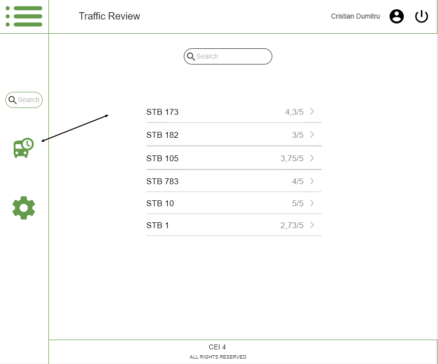
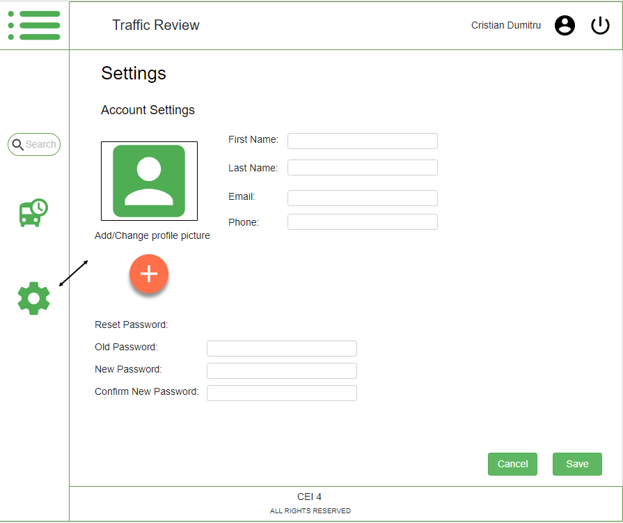

# public-transport-review
Web application that helps people share their experiences using public transportation

## Introducere
- Aplicatia isi propune sa faciliteze utilizarea mijloacelor de transport in comun in ceea ce priveste confortul si evitarea problemelor ce pot fi intampinate in acestea. 
-Vine in ajutorul utilizatorului pentru a-l ghida pana la destinatie intr-un mod cat mai usor si eficient. Aplicatia pune la dispozitie acestuia atat programul de functionare a mijloacelor de transport, cat si rutele si orele de sosire, astfel putand sa isi planifice calatoria cu incredere.
- Se adreseaza persoanelor ce folosesc mijloace de transport in comun de orice fel si fie nu isi doresc experiente neplacute, fie cauta cele mai interesante sau rapide trasee.

Produse similare: 
1. *TripGo* - lets you compare and even combine any transport mode like train, bus, taxi, subway, metro, cab, tram, your own or share car & bike, motorcycle or ride share.
2. *EasyWay* - a public transit app that services Eastern Europe. You can search for optimal routes, bookmark various information, and there is even an offline mode
3. *Moovit* - you can use it to find train schedules, bus schedules, subway schedules, trams, and more. You can then use that info to get to your destination. It even has unique stuff like bike sharing for those days where you want to ride

## Interfete aplicatie



## Rest API

### Modul utilizator:

1. `POST /user/create`

Parameters:

```
  {email: userEmail
  password: userPassword
  confirmPassword: userConfirmPassword}
  ```

Response:

```
 201: created
 40x: user already exists
 40x: password and confirmPassword doesn't match
 501: internal server error
 ```

2. `PUT /user/modify`

Parameters:

```
  {password: userPassword
  newEmail: userNewEmail}
  ```

Response:

```
20x: modified
40x: incorect password
40x: email already exists
501: internal server error
```

3. `PUT /user/resetPass`

Parameters:

```
  {password: userPassword
  newPassword: userNewPassword}
  ```

Response:

```
 20x: password reseted
 40x: incorrect password
 501: internal server error
 ```

### Modul partajare:

4. `POST /review/create`

Parameters:

```
  {leavingPoint
  arrivingPoint
  transport
  leavingHour
  length:
  levelOfCrowd
  notes
  satisfaction}
  ```

Response:

```
 201: created
 501: internal server error
 ```

5. `PUT /review/modify/{idUser}/{idReview}`

Parameters:

`idReview + /review/create parameters`

Response:

```
 20x: modified
 40x: invalid idReview
 50x: internal server error
 ```
 
6. `GET /review/listAll/{idUser}`

Parameters:

`{idUser}`

Response:

`[{reviewObject}]`

7. `DELETE /review/{idReview}`

Parameters:

`{idReview}`

Response:

```
 20x: deleted
 40x: invalid idReview
 50x: internal server error
 ```
 
### Modul cautare:
8. `GET /list?search={searchParam}`

Parameters:

```
  {keywords
  transportType
  transportNumber}
  ```

Response:

`[{reviewObject}]`
